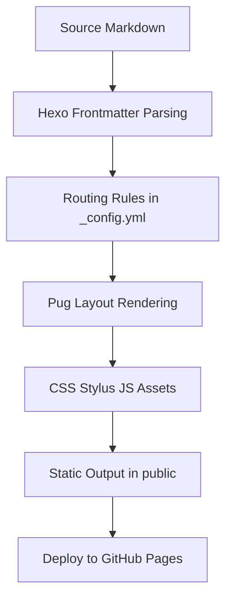

# 结论
这是一个基于 [[Hexo]] 的静态博客工程，采用 [[hexo-theme-academia]] 主题，通过 frontmatter 字段（如 academia、section、layout）驱动页面分流与展示。

# 构建思路
1. 内容层：在 source 下写 Markdown（文章与页面）。
2. 路由层：由 _config.yml 的 permalink 与 index_generator 决定 URL 规则。
3. 视图层：主题使用 Pug 模板渲染首页、列表页与详情页。
4. 样式层：Stylus/CSS 负责视觉，含 Obsidian callout 兼容样式。
5. 产物层：hexo generate 输出到 public，形成可部署静态文件。

# 目录架构与文本格式
- 核心目录：source、themes、public、scaffolds。
- 文本格式：.md、.yml、.json、.pug、.styl、.css、.js、.base。
- 关键约束：skip_render 包含 .base，避免 Base 文件被当作页面渲染。

# 网站实现逻辑
- 首页：layout=home，渲染空容器，作为定制入口。
- Blog 列表：仅展示 academia=true 的文章。
- Notes/Thoughts：按 section=notes|thoughts 在对应模板中筛选文章。
- 页面生成：source 中每个 page/post 结合主题模板生成 public 对应 index.html。
- 标签与归档：由 Hexo 生成器自动聚合到 tags/ 与 archives/。

# 关联
- [[Hexo 配置与路由]]
- [[Hexo 主题渲染机制]]
- [[待创建：frontmatter 驱动分流]]